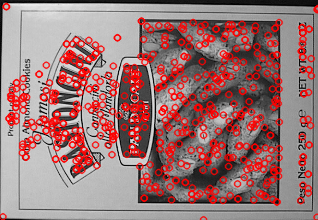

# Team 15

| Name                       | Sec | BN  |
| -------------------------- | --- | --- |
| Ahmed Hossam Mohamed Sedky | 1   | 2   |
| Ahmed Mohammed Abdelfatah  | 1   | 5   |
| Ehab Wahba Abdelrahman     | 1   | 22  |
| Mo'men Maged Mohammed      | 2   | 12  |
| Mohanad Alaa Ragab         | 2   | 31  |

---

## Libraries versions

- numpy version **1.21.3**
- cv2 version **4.5.4-dev**
- matplotlib version **3.4.2**
- time version version **3.7**

---

## Code architecture

- Harris
  - Get gradient of the image in x-direction and y-direction using Sobel.
  ```
   Ix = cv2.Sobel(src, cv2.CV_64F, 1, 0, ksize=5)
   Iy = cv2.Sobel(src, cv2.CV_64F, 0, 1, ksize=5)
  ```
  - Get the second derivative of x,y, and x with respect to y.
  - Apply Gaussian filter to the second derivatives
  ```
      Ixx = cv2.GaussianBlur(src=Ix ** 2, ksize=(5, 5), sigmaX=0)
      Ixy = cv2.GaussianBlur(src=Iy * Ix, ksize=(5, 5), sigmaX=0)
      Iyy = cv2.GaussianBlur(src=Iy ** 2, ksize=(5, 5), sigmaX=0)
  ```
  - Compute the determine and the trace of this matrix
    $$
       \left(\begin{array}{cc}
       Ixx & Ixy\\
       Ixy & Iyy
       \end{array}\right)
    $$
    ```
        det = Ixx *Iyy - (Ixy**2)
        trace = Ixx + Iyy
    ```
  - Compute Harris response "R"
    - where R = determine - k \* (trace)^2 , k :corner sharpness = 0.04
    ```
        harrisResponse = det - k * (trace **2)
    ```
  - Get pixels above specific threshold and color it on the
    original image
  ```
  corner_indices = np.array(harrisMatrix > (hMax * cornerThreshold), dtype="int8")
  image[corner_indices == 1 ] = [0 , 255 ,0]
  ```
- SIFT

  ```python
  image = cv2.imread('your_image.png', 0)
  keypoints, descriptors = SIFT(Image)
  ```

  The returned keypoints are a list of OpenCV KeyPoint objects, and the corresponding descriptors are a list of 128 element NumPy vectors. They can be used just like the objects returned by OpenCV-Python's SIFT detectAndCompute member function.
  To Display the keypoints on the image

  ```python
  keypoint_img = drawKeypoints(image, keypoints, 0, color=(0,0,255))
  imshow("keypoint_img", keypoint_img)
  waitKey(0)
  ```

  

- Feature Matching


    * Read the two images you would to match

    * Generate keypoints and descriptor by SIFT
       ```
        keypoints_1, descriptor1 = SIFT.SIFT(img1)
        keypoints_2, descriptor2 = SIFT.SIFT(img2)

        ```

    * Choose which method you want to use SSD or NCC
        ```
        matches_ssd = matching(descriptor1, descriptor2, calculate_ssd)
        matches_ncc = matching(descriptor1, descriptor2, calculate_ncc)
        
        ```

    * Output is matched keypoint between two images 
